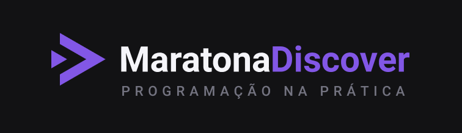

# Maratona-Discover

Você vai aprender programação do zero através de uma metodologia mão na massa e com foco no desenvolvimento web, junto com uma comunidade incrível para te acompanhar durante sua jornada.

Nessa edição, nós vamos construir uma aplicação financeira onde você vai treinar suas habilidades com ferramentas como JavaScript, CSS, HTML, e durante o desenvolvimento você vai descobrir, através das melhores práticas, conceitos importantes que vão te ajudar a construir uma base sólida em programação.

